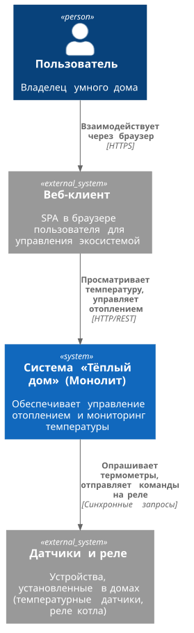
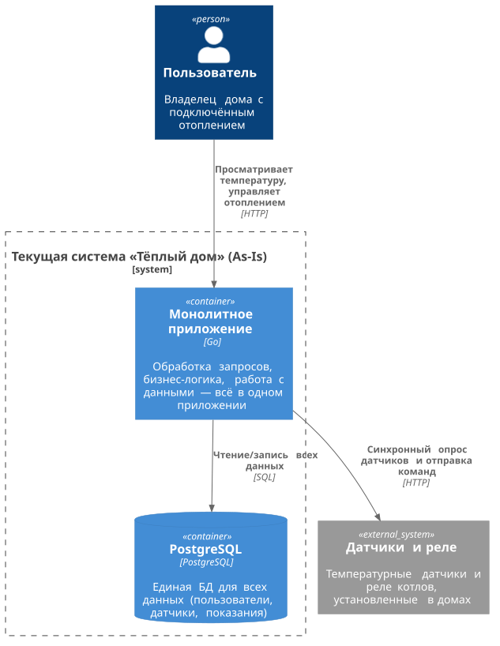
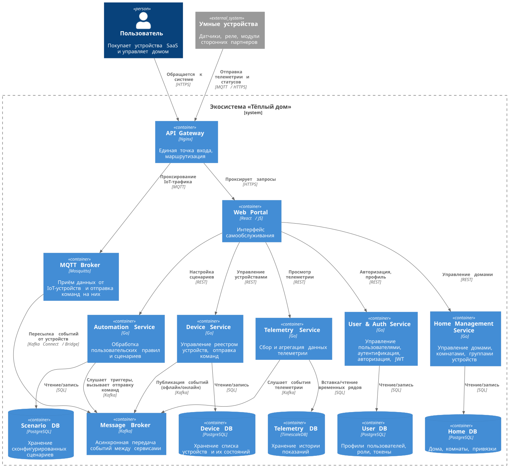
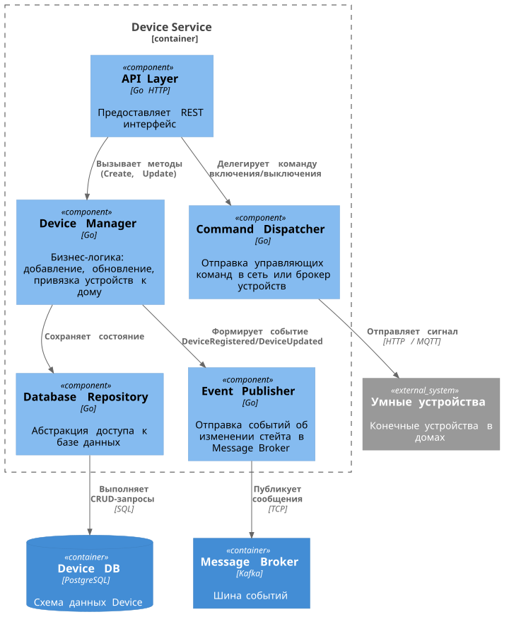
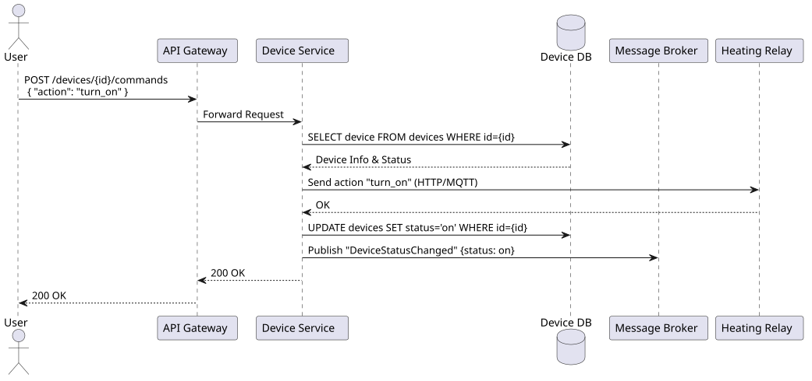
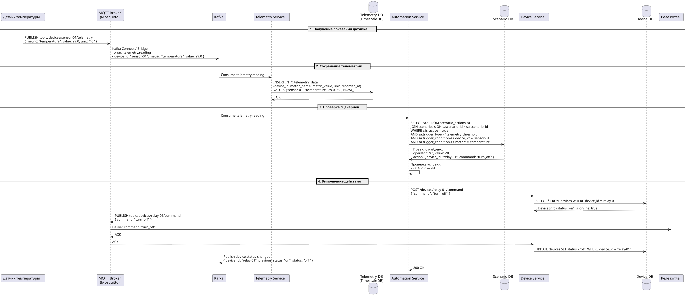
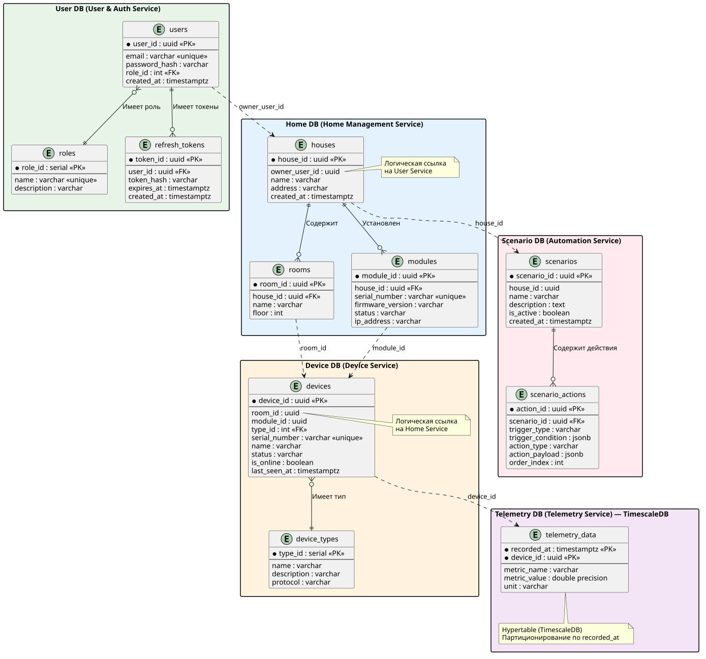

# Project_template

Это решение проектной работы для спринта «Тёплый дом».

# Задание 1. Анализ и планирование

### 1. Описание функциональности монолитного приложения

**Управление отоплением:**
- Пользователи могут удалённо включать и выключать отопление в своих домах.
- Каждая установка сопровождается выездом специалиста для подключения системы отопления.
- Самостоятельное подключение датчика к системе пользователем не поддерживается.
- Система поддерживает только синхронное взаимодействие (от сервера к датчику).

**Мониторинг температуры:**
- Система получает данные о температуре с датчиков, установленных в домах, через синхронный запрос от сервера к датчику.
- Пользователи могут просматривать текущую температуру в своих домах через веб-интерфейс.

### 2. Анализ архитектуры монолитного приложения

- Язык программирования: Go.
- База данных: PostgreSQL.
- Архитектура: Монолитная — все компоненты системы (обработка запросов, бизнес-логика, работа с данными) находятся в рамках одного приложения.
- Взаимодействие: Исключительно синхронное, запросы обрабатываются последовательно. Асинхронных вызовов или брокеров сообщений нет.
- Масштабируемость: Ограничена по причине монолитности. Приходится масштабировать всё приложение целиком, даже если нагрузка возрастает только на чтение телеметрии.
- Развертывание: Требует остановки всего приложения для выкатки обновлений.

### 3. Определение доменов и границы контекстов

Выделены следующие домены (и соответствующие границы контекстов):
1. **Управление устройствами (Device Management):** Регистрация новых устройств в системе, хранение их конфигурации, жизненный цикл и статус, отправка команд (включение/выключение).
2. **Телеметрия (Telemetry):** Сбор метрик и показаний (температура, влажность и т.д.) с датчиков в реальном времени, хранение исторической информации, агрегация.
3. **Управление домом/пользователями (Home & Access Management):** Хранение профилей пользователей, группировка устройств по домам/комнатам, выдача прав доступа и организация экосистемы (SaaS).
4. **Автоматизация и сценарии (Automation Scenarios):** Настройка пользовательских правил (например, «если температура ниже 20, включить реле»).

### **4. Проблемы монолитного решения**

- **Высокая связность и хрупкость:** Падение монолита (например, из-за долгой обработки телеметрии) приводит к невозможности управлять устройствами. Для IoT-систем критичен сбор данных отдельно от управляющих воздействий.
- **Ограничения масштабирования:** Телеметрия генерирует огромный поток данных (write-heavy), в то время как управление конфигурациями и домами — read-heavy. Масштабировать эти части монолита по-отдельности невозможно.
- **Синхронная модель:** Отсутствие брокеров сообщений делает интеграцию с новыми партнерскими устройствами (работающими через MQTT по событиям) архитектурно невозможной в рамках старой парадигмы без блокировок.
- **Узкое «горлышко» развертывания:** Добавление поддержки нового производителя датчиков требует пересборки всего монолита и его простоя. 

### 5. Визуализация контекста системы — диаграмма С4



[Исходник (.puml)](docs/diagrams/01-context-warmhouse.puml) | [Открыть SVG](docs/diagrams/images/01-context-warmhouse.svg)

# Задание 2. Проектирование микросервисной архитектуры

**Диаграмма контейнеров As-Is (текущее состояние)**



[Исходник (.puml)](docs/diagrams/02-container-asis-warmhouse.puml) | [Открыть SVG](docs/diagrams/images/02-container-asis-warmhouse.svg)

**Диаграмма контейнеров To-Be (целевая архитектура)**



[Исходник (.puml)](docs/diagrams/03-container-tobe-warmhouse.puml) | [Открыть SVG](docs/diagrams/images/03-container-tobe-warmhouse.svg)

**Диаграмма компонентов (Components)**
Для микросервиса *Device Service* (Управление устройствами)



[Исходник (.puml)](docs/diagrams/04-component-device-warmhouse.puml) | [Открыть SVG](docs/diagrams/images/04-component-device-warmhouse.svg)

**Диаграмма кода (Code)** 
Диаграмма последовательности для успешного выполнения команды включения реле-устройства.



[Исходник (.puml)](docs/diagrams/05-sequence-relay-warmhouse.puml) | [Открыть SVG](docs/diagrams/images/05-sequence-relay-warmhouse.svg)

**Диаграмма последовательности для автоматического срабатывания сценария**
Пример: датчик температуры фиксирует 29°C, что превышает порог 28°C в сценарии — система автоматически выключает котёл.



[Исходник (.puml)](docs/diagrams/06-sequence-automation-warmhouse.puml) | [Открыть SVG](docs/diagrams/images/06-sequence-automation-warmhouse.svg)

# Задание 3. Разработка ER-диаграммы

В целевой архитектуре применяется паттерн **Database per Service** — каждый микросервис владеет собственной базой данных. Между контекстами нет внешних ключей (FK); связь осуществляется через логические ссылки по ID и обеспечивается согласованность на уровне приложений (eventual consistency).



[Исходник (.puml)](docs/diagrams/07-er-diagram-warmhouse.puml) | [Открыть SVG](docs/diagrams/images/07-er-diagram-warmhouse.svg)

# Задание 4. Создание и документирование API

### 1. Тип API

Основой взаимодействия между фронтендом (или API Gateway) и микросервисами для синхронных запросов (управление, получение состояния, настройка) будет **REST API**. Он оптимально подходит для CRUD-операций и сценариев, когда инициатор должен немедленно узнать результат (например, была ли применена команда включения). Для сбора потоковых данных с датчиков (телеметрия) внутри системы оптимально применять **событийную модель с использованием Message Broker (Kafka)** или протокол **MQTT**, однако публичный контракт для внешних клиентов для управления будет строиться на REST через JSON.

Для асинхронного взаимодействия (события телеметрии, уведомления о смене статуса устройств) используется **AsyncAPI** — контракт для событий, передаваемых через Message Broker (Kafka).

### 2. Документация REST API (OpenAPI 3.0)

Ниже представлен контракт REST API для взаимодействия с Device Service — 5 эндпоинтов.

```yaml
openapi: 3.0.0
info:
  title: Экосистема Тёплый Дом - Device API
  version: 1.0.0
  description: REST API для управления устройствами умного дома

paths:
  /devices:
    get:
      summary: Получение списка устройств
      description: Возвращает список устройств с возможностью фильтрации по дому и пагинацией
      parameters:
        - name: house_id
          in: query
          required: false
          description: Фильтр по идентификатору дома
          schema:
            type: string
            format: uuid
        - name: page
          in: query
          required: false
          schema:
            type: integer
            default: 1
        - name: limit
          in: query
          required: false
          schema:
            type: integer
            default: 20
      responses:
        '200':
          description: Список устройств
          content:
            application/json:
              schema:
                type: object
                properties:
                  items:
                    type: array
                    items:
                      $ref: '#/components/schemas/Device'
                  total:
                    type: integer
                  page:
                    type: integer
                  limit:
                    type: integer
              examples:
                success:
                  summary: Пример успешного ответа
                  value:
                    items:
                      - id: "f47ac10b-58cc-4372-a567-0e02b2c3d479"
                        house_id: "a1b2c3d4-e5f6-7890-abcd-ef1234567890"
                        name: "Термодатчик гостиная"
                        serial_number: "SN-TEMP-001"
                        status: "on"
                        is_online: true
                        type_id: 1
                      - id: "b23dc10b-77aa-4372-b890-1e02b2c3d480"
                        house_id: "a1b2c3d4-e5f6-7890-abcd-ef1234567890"
                        name: "Реле отопления"
                        serial_number: "SN-RELAY-002"
                        status: "off"
                        is_online: true
                        type_id: 2
                    total: 2
                    page: 1
                    limit: 20
        '401':
          description: Не авторизован

    post:
      summary: Регистрация нового устройства
      description: Добавляет новое устройство в систему и привязывает его к дому
      requestBody:
        required: true
        content:
          application/json:
            schema:
              type: object
              required:
                - house_id
                - name
                - type_id
                - serial_number
              properties:
                house_id:
                  type: string
                  format: uuid
                name:
                  type: string
                type_id:
                  type: integer
                serial_number:
                  type: string
            examples:
              temperature_sensor:
                summary: Регистрация температурного датчика
                value:
                  house_id: "a1b2c3d4-e5f6-7890-abcd-ef1234567890"
                  name: "Термодатчик кухня"
                  type_id: 1
                  serial_number: "SN-TEMP-003"
      responses:
        '201':
          description: Устройство успешно зарегистрировано
          content:
            application/json:
              schema:
                $ref: '#/components/schemas/Device'
              examples:
                created:
                  summary: Пример созданного устройства
                  value:
                    id: "c34ed20c-88bb-4483-c901-2f13c3d4e591"
                    house_id: "a1b2c3d4-e5f6-7890-abcd-ef1234567890"
                    name: "Термодатчик кухня"
                    serial_number: "SN-TEMP-003"
                    status: "inactive"
                    is_online: false
                    type_id: 1
        '400':
          description: Неверный формат запроса
        '409':
          description: Устройство с таким serial_number уже существует

  /devices/{deviceId}:
    get:
      summary: Получение подробной информации об устройстве
      parameters:
        - name: deviceId
          in: path
          required: true
          schema:
            type: string
            format: uuid
      responses:
        '200':
          description: Успешный ответ
          content:
            application/json:
              schema:
                $ref: '#/components/schemas/Device'
              examples:
                success:
                  summary: Пример устройства
                  value:
                    id: "f47ac10b-58cc-4372-a567-0e02b2c3d479"
                    house_id: "a1b2c3d4-e5f6-7890-abcd-ef1234567890"
                    name: "Термодатчик гостиная"
                    serial_number: "SN-TEMP-001"
                    status: "on"
                    is_online: true
                    type_id: 1
        '404':
          description: Устройство не найдено

  /devices/{deviceId}/status:
    put:
      summary: Обновление состояния устройства
      description: Используется устройством для heartbeat или оператором для ручного изменения статуса
      parameters:
        - name: deviceId
          in: path
          required: true
          schema:
            type: string
            format: uuid
      requestBody:
        required: true
        content:
          application/json:
            schema:
              type: object
              properties:
                status:
                  type: string
                  enum: [on, off, error, maintenance]
                is_online:
                  type: boolean
            examples:
              heartbeat:
                summary: Heartbeat от устройства
                value:
                  status: "on"
                  is_online: true
              maintenance:
                summary: Перевод в режим обслуживания
                value:
                  status: "maintenance"
                  is_online: true
      responses:
        '200':
          description: Статус успешно обновлен
          content:
            application/json:
              examples:
                success:
                  value:
                    message: "Status updated successfully"
                    device_id: "f47ac10b-58cc-4372-a567-0e02b2c3d479"
                    status: "on"
        '400':
          description: Неверный формат запроса
        '404':
          description: Устройство не найдено

  /devices/{deviceId}/command:
    post:
      summary: Отправка управляющей команды на устройство
      description: Отправляет команду (включить, выключить, задать параметры) на физическое устройство
      parameters:
        - name: deviceId
          in: path
          required: true
          schema:
            type: string
            format: uuid
      requestBody:
        required: true
        content:
          application/json:
            schema:
              type: object
              required:
                - command
              properties:
                command:
                  type: string
                  enum: [turn_on, turn_off, set_temperature, lock, unlock]
                params:
                  type: object
                  additionalProperties: true
            examples:
              turn_on:
                summary: Включение устройства
                value:
                  command: "turn_on"
                  params: {}
              set_temperature:
                summary: Установка целевой температуры
                value:
                  command: "set_temperature"
                  params:
                    temperature_target: 24
      responses:
        '200':
          description: Команда успешно отправлена и обработана устройством
          content:
            application/json:
              examples:
                success:
                  value:
                    message: "Command executed successfully"
                    device_id: "f47ac10b-58cc-4372-a567-0e02b2c3d479"
                    command: "turn_on"
                    result: "ok"
        '403':
          description: Нет доступа к устройству
        '404':
          description: Устройство не найдено
        '500':
          description: Ошибка связи с физическим устройством или таймаут
          content:
            application/json:
              examples:
                timeout:
                  value:
                    error: "Device communication timeout"
                    device_id: "f47ac10b-58cc-4372-a567-0e02b2c3d479"

components:
  schemas:
    Device:
      type: object
      properties:
        id:
          type: string
          format: uuid
        house_id:
          type: string
          format: uuid
        name:
          type: string
        serial_number:
          type: string
        status:
          type: string
          enum: [on, off, inactive, error, maintenance]
        is_online:
          type: boolean
        type_id:
          type: integer
```

### 3. Документация AsyncAPI (асинхронное взаимодействие)

Для событийного взаимодействия между микросервисами через Message Broker (Kafka) используется AsyncAPI.

```yaml
asyncapi: 2.6.0
info:
  title: Экосистема Тёплый Дом - Async Events
  version: 1.0.0
  description: Асинхронные события экосистемы умного дома, передаваемые через Kafka

servers:
  production:
    url: kafka:9092
    protocol: kafka

channels:
  device.status-changed:
    description: Событие при изменении статуса устройства (включение, выключение, ошибка)
    publish:
      summary: Публикация события смены статуса устройства
      operationId: onDeviceStatusChanged
      message:
        payload:
          type: object
          required:
            - device_id
            - status
            - timestamp
          properties:
            device_id:
              type: string
              format: uuid
            previous_status:
              type: string
              enum: [on, off, inactive, error]
            status:
              type: string
              enum: [on, off, inactive, error]
            timestamp:
              type: string
              format: date-time
        examples:
          - payload:
              device_id: "f47ac10b-58cc-4372-a567-0e02b2c3d479"
              previous_status: "off"
              status: "on"
              timestamp: "2025-01-15T10:30:00Z"

  telemetry.reading:
    description: Новое показание телеметрии от датчика
    publish:
      summary: Публикация данных телеметрии
      operationId: onTelemetryReading
      message:
        payload:
          type: object
          required:
            - device_id
            - metric_name
            - value
            - recorded_at
          properties:
            device_id:
              type: string
              format: uuid
            metric_name:
              type: string
              example: "temperature"
            value:
              type: number
              format: double
              example: 22.5
            unit:
              type: string
              example: "°C"
            recorded_at:
              type: string
              format: date-time
        examples:
          - payload:
              device_id: "f47ac10b-58cc-4372-a567-0e02b2c3d479"
              metric_name: "temperature"
              value: 22.5
              unit: "°C"
              recorded_at: "2025-01-15T10:30:00Z"
```

# Задание 5. Работа с docker и docker-compose

Перейдите в apps.

Там находится приложение-монолит для работы с датчиками температуры. В README.md описано как запустить решение.

Вам нужно:

1) сделать простое приложение temperature-api на любом удобном для вас языке программирования, которое при запросе /temperature?location= будет отдавать рандомное значение температуры.

Locations - название комнаты, sensorId - идентификатор названия комнаты

```
	// If no location is provided, use a default based on sensor ID
	if location == "" {
		switch sensorID {
		case "1":
			location = "Living Room"
		case "2":
			location = "Bedroom"
		case "3":
			location = "Kitchen"
		default:
			location = "Unknown"
		}
	}

	// If no sensor ID is provided, generate one based on location
	if sensorID == "" {
		switch location {
		case "Living Room":
			sensorID = "1"
		case "Bedroom":
			sensorID = "2"
		case "Kitchen":
			sensorID = "3"
		default:
			sensorID = "0"
		}
	}
```

2) Приложение следует упаковать в Docker и добавить в docker-compose. Порт по умолчанию должен быть 8081

3) Кроме того для smart_home приложения требуется база данных - добавьте в docker-compose файл настройки для запуска postgres с указанием скрипта инициализации ./smart_home/init.sql

Для проверки можно использовать Postman коллекцию smarthome-api.postman_collection.json и вызвать:

- Create Sensor
- Get All Sensors

Должно при каждом вызове отображаться разное значение температуры

Ревьюер будет проверять точно так же.
