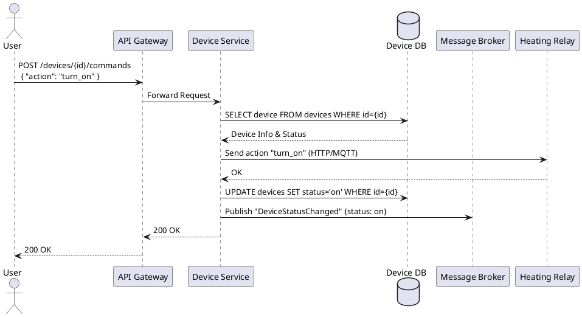
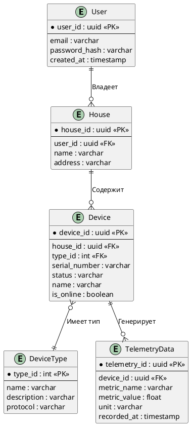

# Project_template

Это решение проектной работы для спринта «Тёплый дом».

# Задание 1. Анализ и планирование

### 1. Описание функциональности монолитного приложения

**Управление отоплением:**
- Пользователи могут удалённо включать и выключать отопление в своих домах.
- Каждая установка сопровождается выездом специалиста для подключения системы отопления.
- Самостоятельное подключение датчика к системе пользователем не поддерживается.
- Система поддерживает только синхронное взаимодействие (от сервера к датчику).

**Мониторинг температуры:**
- Система получает данные о температуре с датчиков, установленных в домах, через синхронный запрос от сервера к датчику.
- Пользователи могут просматривать текущую температуру в своих домах через веб-интерфейс.

### 2. Анализ архитектуры монолитного приложения

- Язык программирования: Go.
- База данных: PostgreSQL.
- Архитектура: Монолитная — все компоненты системы (обработка запросов, бизнес-логика, работа с данными) находятся в рамках одного приложения.
- Взаимодействие: Исключительно синхронное, запросы обрабатываются последовательно. Асинхронных вызовов или брокеров сообщений нет.
- Масштабируемость: Ограничена по причине монолитности. Приходится масштабировать всё приложение целиком, даже если нагрузка возрастает только на чтение телеметрии.
- Развертывание: Требует остановки всего приложения для выкатки обновлений.

### 3. Определение доменов и границы контекстов

Выделены следующие домены (и соответствующие границы контекстов):
1. **Управление устройствами (Device Management):** Регистрация новых устройств в системе, хранение их конфигурации, жизненный цикл и статус, отправка команд (включение/выключение).
2. **Телеметрия (Telemetry):** Сбор метрик и показаний (температура, влажность и т.д.) с датчиков в реальном времени, хранение исторической информации, агрегация.
3. **Управление домом/пользователями (Home & Access Management):** Хранение профилей пользователей, группировка устройств по домам/комнатам, выдача прав доступа и организация экосистемы (SaaS).
4. **Автоматизация и сценарии (Automation Scenarios):** Настройка пользовательских правил (например, «если температура ниже 20, включить реле»).

### **4. Проблемы монолитного решения**

- **Высокая связность и хрупкость:** Падение монолита (например, из-за долгой обработки телеметрии) приводит к невозможности управлять устройствами. Для IoT-систем критичен сбор данных отдельно от управляющих воздействий.
- **Ограничения масштабирования:** Телеметрия генерирует огромный поток данных (write-heavy), в то время как управление конфигурациями и домами — read-heavy. Масштабировать эти части монолита по-отдельности невозможно.
- **Синхронная модель:** Отсутствие брокеров сообщений делает интеграцию с новыми партнерскими устройствами (работающими через MQTT по событиям) архитектурно невозможной в рамках старой парадигмы без блокировок.
- **Узкое «горлышко» развертывания:** Добавление поддержки нового производителя датчиков требует пересборки всего монолита и его простоя. 

### 5. Визуализация контекста системы — диаграмма С4

```plantuml
@startuml
!include https://raw.githubusercontent.com/plantuml-stdlib/C4-PlantUML/master/C4_Context.puml

Person(user, "Пользователь", "Владелец умного дома")
System(warmhouse, "Система «Тёплый дом» (Монолит)", "Обеспечивает управление отоплением и мониторинг температуры")
System_Ext(sensors, "Датчики и реле", "Устройства, установленные в домах (температурные датчики, реле котла)")

Rel(user, warmhouse, "Просматривает температуру, включает/выключает отопление", "HTTP")
Rel(warmhouse, sensors, "Опрашивает термометры, отправляет команды на реле", "Синхронные запросы")
@enduml
```

# Задание 2. Проектирование микросервисной архитектуры

**Диаграмма контейнеров (Containers)**

```plantuml
@startuml
!include https://raw.githubusercontent.com/plantuml-stdlib/C4-PlantUML/master/C4_Container.puml

Person(user, "Пользователь", "Покупает устройства SaaS и управляет домом")

System_Boundary(ecosystem, "Экосистема «Тёплый дом»") {
    Container(web_app, "Web Portal", "React / JS", "Интерфейс самообслуживания")
    Container(api_gateway, "API Gateway", "Go", "Единая точка входа, авторизация, маршрутизация")
    
    Container(device_service, "Device Service", "Go", "Управление реестром устройств, отправка команд")
    ContainerDb(device_db, "Device DB", "PostgreSQL", "Хранение списка устройств, домов и привязок")
    
    Container(telemetry_service, "Telemetry Service", "Go", "Сбор и агрегация данных телеметрии")
    ContainerDb(telemetry_db, "Telemetry DB", "TimescaleDB", "Хранение истории показаний")
    
    Container(scenario_service, "Automation Service", "Go", "Обработка пользовательских правил и сценариев")
    ContainerDb(scenario_db, "Scenario DB", "PostgreSQL", "Хранение сконфигурированных сценариев")

    Container(message_broker, "Message Broker", "Kafka / RabbitMQ", "Асинхронная передача событий")
}

System_Ext(devices, "Умные устройства", "Датчики, реле, модули сторонних партнеров")

Rel(user, web_app, "Управляет экосистемой", "HTTPS")
Rel(web_app, api_gateway, "REST API вызовы", "HTTPS")

Rel(api_gateway, device_service, "Управление устройствами", "REST/gRPC")
Rel(api_gateway, telemetry_service, "Получение истории", "REST/gRPC")
Rel(api_gateway, scenario_service, "Настройка правил", "REST/gRPC")

Rel(device_service, device_db, "Чтение/запись", "SQL")
Rel(telemetry_service, telemetry_db, "Вставка/чтение временных рядов", "SQL")
Rel(scenario_service, scenario_db, "Чтение/запись", "SQL")

Rel(devices, api_gateway, "Отправка телеметрии и статусов", "HTTP(S)")
Rel(device_service, message_broker, "Публикация событий (офлайн/онлайн)", "AMQP")
Rel(telemetry_service, message_broker, "Слушает события, генерирует триггеры", "AMQP")
Rel(scenario_service, message_broker, "Слушает триггеры, вызывает отправку команд", "AMQP")
Rel(device_service, devices, "Отправка команд", "HTTP(S) / MQTT")
@enduml
```

**Диаграмма компонентов (Components)**
Для микросервиса *Device Service* (Управление устройствами)

```plantuml
@startuml
!include https://raw.githubusercontent.com/plantuml-stdlib/C4-PlantUML/master/C4_Component.puml

Container_Boundary(device_service, "Device Service") {
    Component(api, "API Layer", "Go HTTP/gRPC", "Предоставляет REST/gRPC интерфейс")
    Component(device_manager, "Device Manager", "Go", "Бизнес-логика: добавление, обновление, привязка устройств к дому")
    Component(command_sender, "Command Dispatcher", "Go", "Отправка управляющих команд в сеть или брокер устройств")
    Component(repo, "Database Repository", "Go", "Абстракция доступа к базе данных")
    Component(event_publisher, "Event Publisher", "Go", "Отправка событий об изменении стейта в Message Broker")
}

ContainerDb(device_db, "Device DB", "PostgreSQL", "Схема данных Device")
Container(message_broker, "Message Broker", "Kafka", "Шина событий")
System_Ext(devices, "Умные устройства", "Конечные устройства в домах")

Rel(api, device_manager, "Вызывает методы (Сreate, Update)")
Rel(api, command_sender, "Делегирует команду включения/выключения")
Rel(device_manager, repo, "Сохраняет состояние")
Rel(device_manager, event_publisher, "Формирует событие DeviceRegistered/DeviceUpdated")
Rel(repo, device_db, "Выполняет CRUD-запросы", "SQL")
Rel(event_publisher, message_broker, "Публикует сообщения", "TCP")
Rel(command_sender, devices, "Отправляет сигнал", "HTTP / MQTT")
@enduml
```

**Диаграмма кода (Code)** 
Диаграмма последовательности для успешного выполнения команды включения реле-устройства.



# Задание 3. Разработка ER-диаграммы



# Задание 4. Создание и документирование API

### 1. Тип API

Основой взаимодействия между фронтендом (или API Gateway) и микросервисами для синхронных запросов (управление, получение состояния, настройка) будет **REST API**. Он оптимально подходит для CRUD-операций и сценариев, когда инициатор должен немедленно узнать результат (например, была ли применена команда включения). Для сбора потоковых данных с датчиков (телеметрия) внутри системы оптимально применять **событийную модель с использованием Message Broker (Kafka)** или протокол **MQTT**, однако публичный контракт для внешних клиентов для управления будет строиться на REST через JSON.

### 2. Документация API

Ниже представлен контракт REST API (в формате OpenAPI 3.0) для взаимодействия с Device Service.

```yaml
openapi: 3.0.0
info:
  title: Экосистема Тёплый Дом - Device API
  version: 1.0.0
paths:
  /devices/{deviceId}:
    get:
      summary: Получение подробной информации об устройстве
      parameters:
        - name: deviceId
          in: path
          required: true
          schema:
            type: string
            format: uuid
      responses:
        '200':
          description: Успешный ответ
          content:
            application/json:
              schema:
                $ref: '#/components/schemas/Device'
        '404':
          description: Устройство не найдено

  /devices/{deviceId}/status:
    put:
      summary: Обновление состояния устройства (обычно используется самим устройством для heartbeats)
      parameters:
        - name: deviceId
          in: path
          required: true
          schema:
            type: string
            format: uuid
      requestBody:
        required: true
        content:
          application/json:
            schema:
              type: object
              properties:
                status:
                  type: string
                is_online:
                  type: boolean
      responses:
        '200':
          description: Статус успешно обновлен
        '400':
          description: Неверный формат запроса

  /devices/{deviceId}/command:
    post:
      summary: Отправка управляющей команды на устройство
      parameters:
        - name: deviceId
          in: path
          required: true
          schema:
            type: string
            format: uuid
      requestBody:
        required: true
        content:
          application/json:
            schema:
              type: object
              properties:
                command:
                  type: string
                  example: "turn_on"
                params:
                  type: object
                  example: {"temperature_target": 24}
      responses:
        '200':
          description: Команда успешно отправлена и обработана устройством
        '403':
          description: Нет доступа к устройству
        '500':
          description: Ошибка связи с физическим устройством или таймаут

components:
  schemas:
    Device:
      type: object
      properties:
        id:
          type: string
          format: uuid
        house_id:
          type: string
          format: uuid
        name:
          type: string
        status:
          type: string
        is_online:
          type: boolean
        type_id:
          type: integer
```

# Задание 5. Работа с docker и docker-compose

Перейдите в apps.

Там находится приложение-монолит для работы с датчиками температуры. В README.md описано как запустить решение.

Вам нужно:

1) сделать простое приложение temperature-api на любом удобном для вас языке программирования, которое при запросе /temperature?location= будет отдавать рандомное значение температуры.

Locations - название комнаты, sensorId - идентификатор названия комнаты

```
	// If no location is provided, use a default based on sensor ID
	if location == "" {
		switch sensorID {
		case "1":
			location = "Living Room"
		case "2":
			location = "Bedroom"
		case "3":
			location = "Kitchen"
		default:
			location = "Unknown"
		}
	}

	// If no sensor ID is provided, generate one based on location
	if sensorID == "" {
		switch location {
		case "Living Room":
			sensorID = "1"
		case "Bedroom":
			sensorID = "2"
		case "Kitchen":
			sensorID = "3"
		default:
			sensorID = "0"
		}
	}
```

2) Приложение следует упаковать в Docker и добавить в docker-compose. Порт по умолчанию должен быть 8081

3) Кроме того для smart_home приложения требуется база данных - добавьте в docker-compose файл настройки для запуска postgres с указанием скрипта инициализации ./smart_home/init.sql

Для проверки можно использовать Postman коллекцию smarthome-api.postman_collection.json и вызвать:

- Create Sensor
- Get All Sensors

Должно при каждом вызове отображаться разное значение температуры

Ревьюер будет проверять точно так же.
